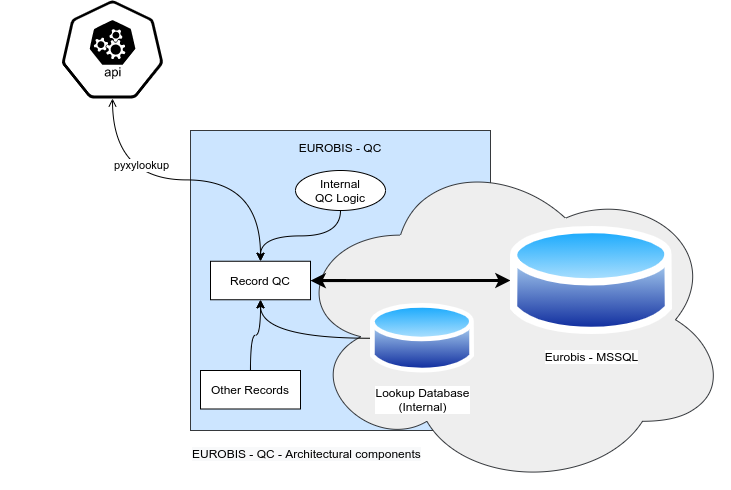
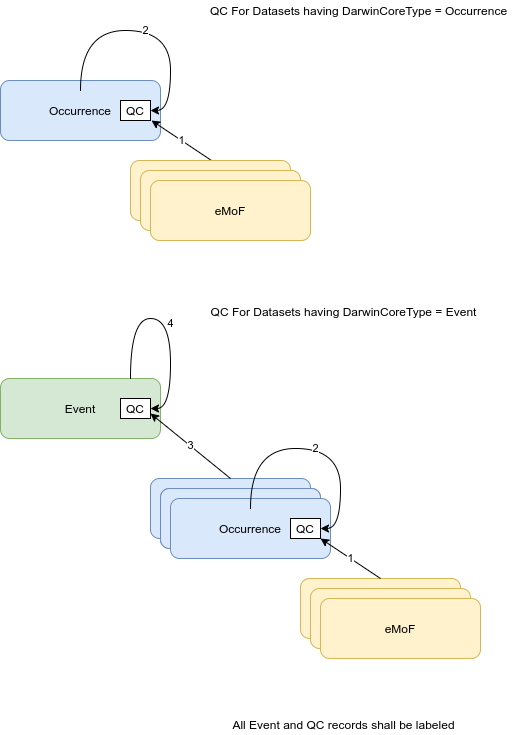

# EUROBIS-QC

## Background
Implementation of a seiries of Quality Control checks on EUROBIS DwC-A records (dictionaries).

Based on:

obistools: https://github.com/iobis/obistools
obis-qc: https://github.com/iobis/obis-qc
dwca-processor: https://github.com/iobis/dwca-processor

And other libraries, almost all from Pieter Provoost. 

## QC System architecture 

The QC for the the eMoF/MoF records are exclusively based on lookups from a locally available SQLITE database. 
This also contains a copy of the WORMS database for lookup of the aphia ids. 

Furthermore, the verification of the record's Lat/Lon to ascertain that a point is at sea and that the reported 
depth is coherent with the depth map of the point is performed through calls to the pyxylookup service. 
These calls are performed for batches of 1000 (and leftovers) points for better network usage.  

#### Main system components   

The diagram below can help figure out at a glance the main architectural components of the EUROBIS-QC concept.



The QCs works on Events/Occurrence records from DwCA files as well as on records stored in a MSSQL database. 
The examples provided, all found under /eurobisqc/test, are explicatory of the ways to process:

- a single DwCA file (QCs are not saved) (run_dwca_pipeline.py)
- a set of DwCA files contained in a directory using multiprocessing (run_dwca_multiprocess.py)
- a dataset contained in the eurobis database (run_mssql_pipeline.py) - **UPDATING** the database
- a random number of datasets (2% selected among those with less than 2500 records) from the database **UPDATING** the
  database

#### QC applied to records 
QC is calculated on Event Records and Occurrence records, as follows: 

  
The class at the core of the system is the Enum QFlag, in eurobisqc.util.qc_flags. It contains all the defined QCs, 
and utilities to combine/encode/decode QC flags:

```python
    REQUIRED_FIELDS_PRESENT = ("All the required fields are present", 1)  # In required_fields
    TAXONOMY_APHIAID_PRESENT = ("AphiaID found", 2)  # In taxonomy_db
    TAXONOMY_RANK_OK = ("Taxon level more detailed than Genus", 3)  # In taxonomy_db
    GEO_LAT_LON_PRESENT = ("Lat and Lon present and not equal to None", 4)  # In location
    GEO_LAT_LON_VALID = ("Lat or Lon present and valid (-90 to 90 and -180 to 180)", 5)  # In location
    GEO_LAT_LON_ON_SEA = ("Lat - Lon on sea / coastline", 6)  # In location
    DATE_TIME_OK = ("Year or Start Year or End Year complete and valid", 7)  # In time_qc
    TAXON_APHIAID_NOT_EXISTING = ("Marine Taxon not existing in APHIA", 8)  # FLAG - NOT IMPLEMENTED
    GEO_COORD_AREA = ("Coordinates in one of the specified areas", 9)  # In location
    OBIS_DATAFORMAT_OK = ("Valid codes found in basisOfRecord", 10)  # in required_fields
    VALID_DATE_1 = ("Valid sampling date", 11)  # In time_qc
    VALID_DATE_2 = ("Start sampling date before End date - dates consistent", 12)  # In time_qc
    VALID_DATE_3 = ("Sampling time valid / timezone completed", 13)  # In time_qc
    OBSERVED_COUNT_PRESENT = ("Observed individual count found", 14)  # In measurements
    OBSERVED_WEIGTH_PRESENT = ("Observed weigth found", 15)  # In measurements
    SAMPLE_SIZE_PRESENT = ("Observed individual count > 0 sample size present", 16)  # In measurements
    SEX_PRESENT = ("Sex observation found", 17)  # In measurements
    MIN_MAX_DEPTH_VERIFIED = ("Depths consistent", 18)  # in location
    DEPTH_MAP_VERIFIED = ("Depth coherent with depth map", 19)  # In location
    DEPTH_FOR_SPECIES_OK = ("Depth coherent with species depth range", 20)  # FLAG - NOT IMPLEMENTED

```

It has been agreed to not implement QCs 8 and 20 for the moment, so there is no QC procedure that deals with these two.  


## Installation

### Ubuntu Linux 20.04 

#### Starting from scratch - creating the basis
You need to have Python3 installed (default) and as a minimum the modules pip and venv : 
```commandline
sudo apt install python3-pip python3-venv
```
You need to have git installed: 
```
sudo apt install git 
```
Futehrmore, you need to have odbc installed if you want to use the pyodbc driver for MS SQL or freetds for the pymssql 
driver:
```commandline
sudo apt install unixodbc-dev freetds-bin freetds-dev  
```
On ubuntu, you also need tk (there are some basic graphic elements in the demo programs). 
```commandline
sudo apt install python3-tk 
```


#### Create the virtual environment
Create a directory where you want to install the project and make a virtual environment, then activate it : 
```commandline
mkdir EUROBISQC
python3 -m venv eurobis-qc-venv 
source ./eurobis-qc-venv/bin/activate 
```
#### Clone the repository: 
```
git clone https://github.com/anfe67/eurobis-qc.git  
```
#### Customize the configuration 
Edit the config.ini file contained in dbworks/resources/config.ini, by filling the following fields as in the 
example below:

```editorconfig
[SQLSERVERDB]
driver        = ODBC Driver 17 for SQL Server
drivermodule  = pymssql
# drivermodule can be pymssql or pyodbc (needs to be specified).
server        = 127.0.0.1
server_local  = True
# server local will determine the number of processes spawned. MSSQL needs two cores to work OK
port          = 1433
database      = eurobis_dat
username      = sa
password      = <Your Password>

```
Please notice that server_local must be True if the database is running on the same machine, False otherwise. 
The configuration of the lookup DB does not change and a sample, which has been used during the development has 
been provided. Instructions to modify the lookup database can be found in the specific documentation. 

#### Local Installation
Once all the configuration is performed, the project can be installing by running the setup file: 


